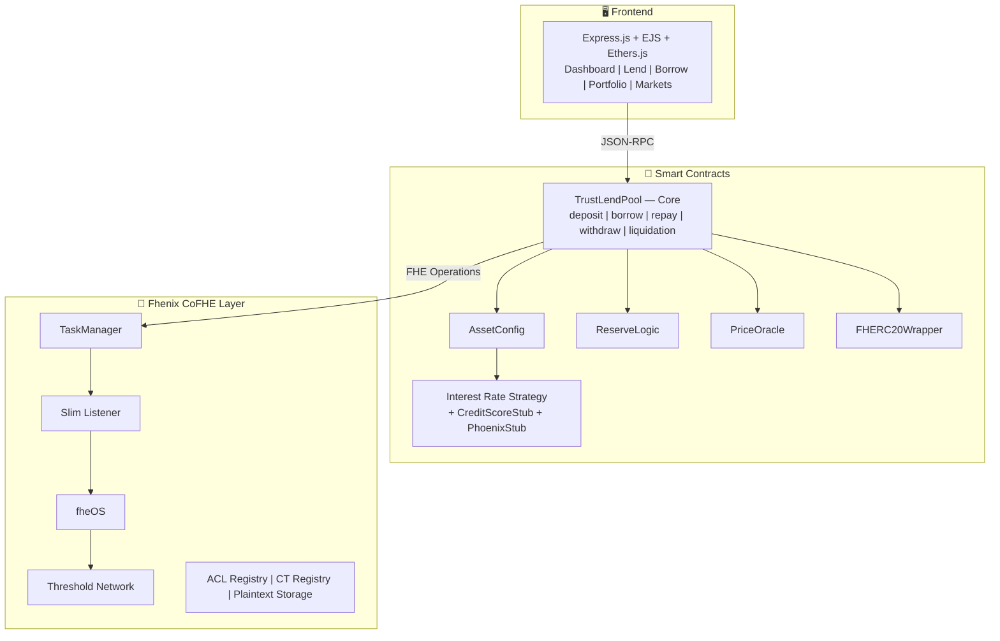
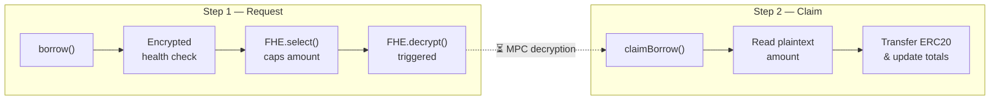

# Protocol Overview

Fhield (TrustLend) is an **encrypted lending protocol** that mirrors the AAVE V3 architecture while replacing user-facing balances with FHE-encrypted values. The protocol maintains privacy for individual positions while keeping global pool parameters (total deposits, rates, indices) in plaintext for interest calculation integrity.

## High-Level Architecture

## Data Flow

### Encryption Path (Client → Contract)
1. User encrypts input via `@cofhe/sdk` with ZK proof
2. ZK Verifier on-chain validates proof and signs ciphertext
3. Contract receives `InEuint64` struct, converts via `FHE.asEuint64()`
4. All operations on encrypted data produce new ciphertext handles

### Decryption Path (Contract → Client)
1. Contract calls `FHE.decrypt(ciphertext)` — submits to TaskManager
2. Slim Listener picks up task, submits to fheOS
3. Threshold Network performs MPC decryption (no single entity holds the key)
4. Result Processor publishes plaintext + signature on-chain
5. Contract/User reads result via `FHE.getDecryptResultSafe()`

### Two-Step Async Pattern

Borrow, Withdraw and Liquidation use a **two-step async** pattern because they require off-chain decryption:

## What's Encrypted vs. Plaintext

| Data | Storage | Reason |
|------|---------|--------|
| User collateral balance | `euint64` (encrypted) | Core privacy guarantee |
| User debt balance | `euint64` (encrypted) | Core privacy guarantee |
| Health check result | `ebool` (encrypted) | Prevents front-running liquidations |
| Pending borrow/withdraw amount | `euint64` → decrypted async | Needed for ERC20 transfer |
| Total deposits per asset | `uint256` (plaintext) | Required for utilization & interest calculation |
| Total borrows per asset | `uint256` (plaintext) | Required for utilization & interest calculation |
| Liquidity/Borrow indices | `uint256` (plaintext, RAY) | Must scale encrypted balances deterministically |
| Interest rates | `uint256` (plaintext, RAY) | Public market rates |
| Asset prices | `uint256` (plaintext) | Must be consistent for all users |
| LTV / Liquidation params | `uint256` (plaintext) | Protocol parameters, governance-controlled |

## Security Properties

1. **Balance Privacy**: Individual positions hidden from everyone except the owner
2. **Zero-Replacement Pattern**: Failed operations return 0 instead of reverting (prevents information leakage from reverts)
3. **Constant-Time Processing**: All asset loops execute regardless of which assets the user holds (prevents timing side-channels)
4. **ACL Enforcement**: `FHE.allowThis()` after every encrypted mutation; `FHE.allow(user)` for owner access
5. **Threshold Decryption**: MPC network prevents single point of failure in key management
6. **No Branching on Encrypted**: Uses `FHE.select()` instead of `if/else` — encrypted values can't be evaluated as booleans
