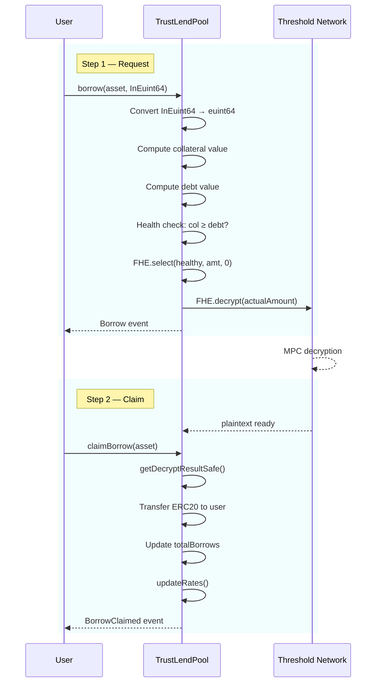

# Borrow Flow

Borrowing is a **two-step async** operation because it requires off-chain decryption of the approved amount. The user submits an encrypted borrow request, the protocol performs an encrypted health check, and the actual amount is determined after decryption.

## Sequence

## Step 1: `borrow(asset, InEuint64)`

1. **Input Conversion**: Client-encrypted `InEuint64` is converted to `euint64` via `FHE.asEuint64()`
2. **Collateral Computation**: Iterates ALL assets, normalizes each encrypted balance, multiplies by `price × LTV`, sums total
3. **CreditScore Boost**: Applies `getLTVBoost(user)` to collateral value (currently 0%)
4. **Debt Computation**: Same pattern for all debt balances × prices
5. **Health Check**: `FHE.gte(totalCollateral, totalDebt + newBorrowValue)` → `ebool`
6. **Zero-Replacement**: `FHE.select(isHealthy, requestedAmount, zero)` — if unhealthy, amount becomes 0
7. **Async Decrypt**: `FHE.decrypt(actualAmount)` submits to Threshold Network
8. **Store Pending**: `_pendingBorrows[user][asset] = actualAmount`

## Step 2: `claimBorrow(asset)`

1. **Check Ready**: `FHE.getDecryptResultSafe(pendingBorrow)` — reverts if decrypt not complete
2. **Transfer**: Sends plaintext ERC20 amount to user
3. **Update State**: Adjusts `totalBorrows`, recalculates rates
4. **Clean Up**: Clears pending borrow

## Why Two Steps?

FHE operations are symbolic — the actual computation happens off-chain via the CoFHE infrastructure. When the contract calls `FHE.decrypt()`, the Threshold Network must:
1. Retrieve the ciphertext
2. Perform MPC decryption (multiple nodes each contribute a share)
3. Publish the plaintext result on-chain

This takes time (typically seconds to minutes), so the user must come back with a second transaction to claim the result.

## Edge Cases

- **Unhealthy position**: Borrow amount silently becomes 0 (no revert). User claims 0 tokens.
- **Pending borrow exists**: Must claim before requesting another borrow on same asset
- **Zero claim**: If decrypted amount is 0, claim succeeds but no tokens transfer
