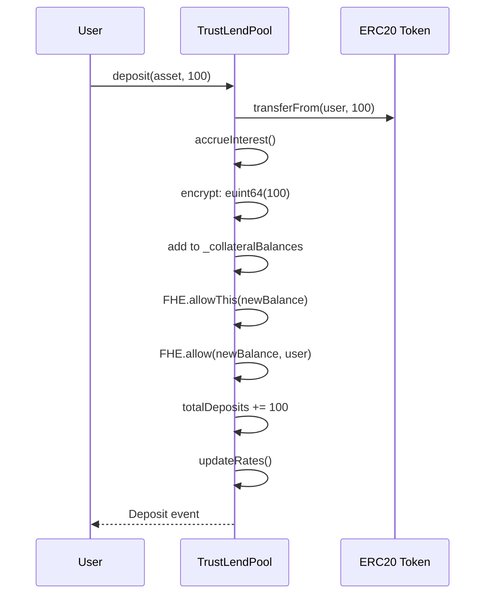

# Deposit Flow

Depositing adds collateral to the lending pool. The user supplies a plaintext ERC20 amount, which gets stored as an encrypted balance on-chain.

## Sequence

## Steps

1. **Interest Accrual**: Reserve indices are updated to account for time elapsed since last operation
2. **Token Transfer**: ERC20 tokens move from user to the pool contract
3. **Encryption**: The plaintext amount is encrypted as `euint64` and added to the user's existing encrypted balance (normalized by current liquidity index)
4. **ACL Setup**: `FHE.allowThis()` ensures the contract can access the ciphertext; `FHE.allow(user)` lets the user decrypt their balance
5. **Rate Update**: Interest rates are recalculated based on new utilization

## Notes

- Deposit takes **plaintext** input (the amount is visible in transaction calldata)
- For fully private deposits, use `FHERC20Wrapper.wrap()` which accepts encrypted input
- First deposit stores the index snapshot; subsequent deposits normalize the old balance before adding
- Single transaction — no async step needed
