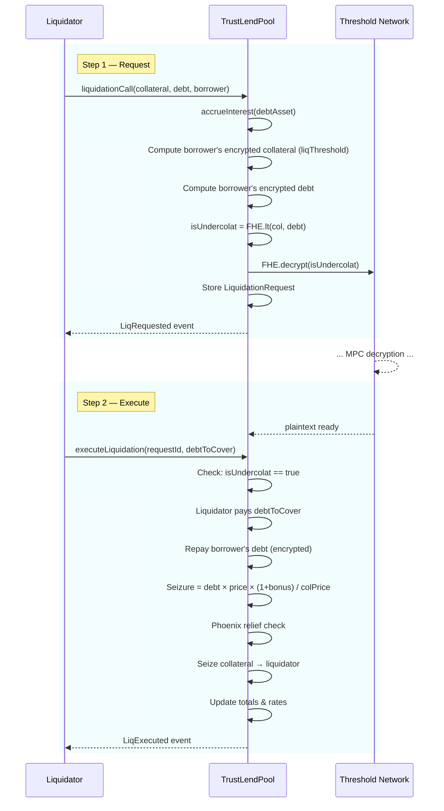

# Liquidation Flow

Liquidation is a **two-step async** process that allows third-party liquidators to repay an undercollateralized borrower's debt in exchange for a collateral bonus.

## Sequence



## Step 1: `liquidationCall(collateralAsset, debtAsset, borrower)`

1. **Accrue Interest**: On the debt asset's reserve
2. **Compute Encrypted Values**:
   - Collateral: uses `liquidationThreshold` (not LTV) — a higher bar than borrowing
   - Debt: summed across all assets at current prices
3. **Encrypted Check**: `isUndercollateralized = FHE.lt(collateralValue, debtValue)`
4. **Decrypt**: Submit encrypted boolean to Threshold Network
5. **Store Request**: Creates a `LiquidationRequest` struct indexed by ID

**Returns**: `requestId` for tracking

### Why `liquidationThreshold` not `LTV`?

- **LTV** (e.g., 75%) determines maximum borrowing power
- **Liquidation Threshold** (e.g., 80%) is the trigger for liquidation
- The gap between them is the **safety buffer** — users can borrow at 75% but aren't liquidated until 80%

## Step 2: `executeLiquidation(requestId, debtToCover)`

1. **Verify**: Decrypt result must be `true` (position IS undercollateralized)
2. **Liquidator Payment**: Transfers `debtToCover` tokens to the pool
3. **Debt Repayment**: Reduces borrower's encrypted debt
4. **Collateral Seizure**:
   ```
   seizureAmount = (debtToCover × debtPrice × (PERCENTAGE_PRECISION + liquidationBonus)) 
                   / (collateralPrice × PERCENTAGE_PRECISION)
   ```
5. **Phoenix Relief**: Calls `_triggerPhoenixRelief()` — currently returns 0%
6. **Transfer**: Sends seized collateral to liquidator
7. **Update State**: Adjusts totals and rates

## Liquidation Parameters

| Parameter | Value | Effect |
|-----------|-------|--------|
| `CLOSE_FACTOR` | 50% | Max portion of debt repayable per liquidation |
| `liquidationThreshold` | Per-asset (e.g., 80%) | Position health trigger |
| `liquidationBonus` | Per-asset (e.g., 5%) | Extra collateral reward for liquidator |

## Example

User has:
- 1000 USDC collateral (price \$1, liq. threshold 80% → \$800 effective)
- \$850 WETH debt

**Step 1**: Liquidator calls `liquidationCall()` → encrypted check: \$800 < \$850 → `true` → decrypt confirms undercollateralized

**Step 2**: Liquidator covers \$425 (50% of \$850):
- Seizure = \$425 × 1.05 = \$446.25 worth of USDC collateral
- Borrower's debt reduced by \$425
- Borrower's collateral reduced by \$446.25
- Liquidator receives \$446.25 USDC for paying \$425 WETH → **\$21.25 profit**
