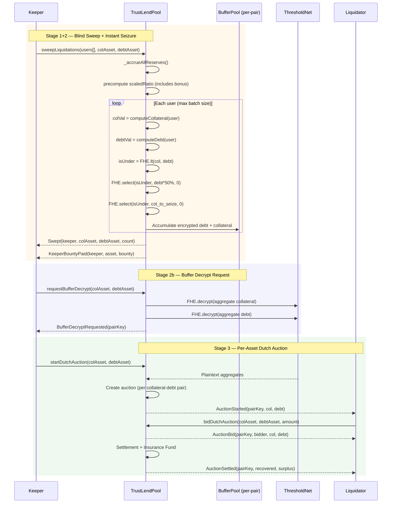
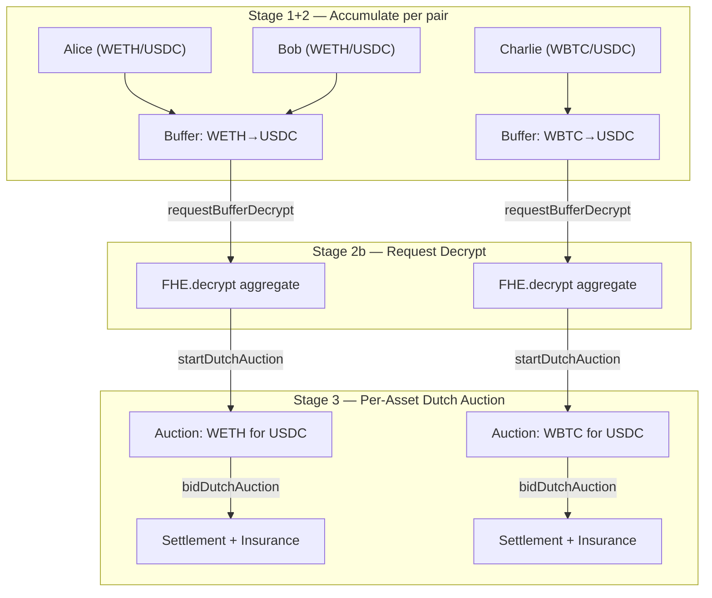
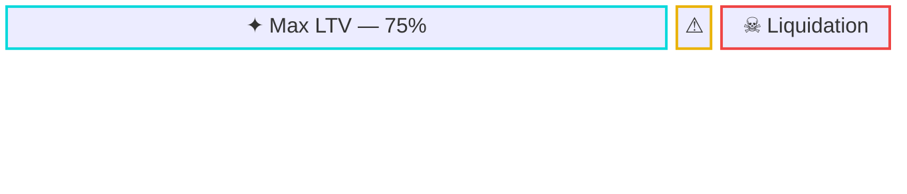

# Liquidation — fhield Buffer Model

:::tip What Makes This Different
fhield is the **first lending protocol** to solve the FHE liquidation trilemma: maintaining borrower privacy, ensuring instant bad debt absorption, and eliminating MEV — all in a single unified architecture. The fhield Buffer Model is fhield's flagship innovation.
:::

Liquidation in fhield is a **privacy-preserving risk management system** built on the **fhield Buffer Model** architecture. Instead of forcing liquidators to target individual users (which leaks identity), the protocol absorbs bad debt into an intermediary **fhield Buffer Pool** within encrypted space, then auctions it to liquidators in bulk via a **Dutch Auction**.

### Design Philosophy: Decoupled Liquidation

| Principle | Description |
|---|---|
| **Identity Privacy** | No one knows which user in a batch was liquidated |
| **Instant Bad Debt Absorption** | Protocol handles bad debt immediately in FHE space — no decryption wait |
| **Bulk Settlement** | Liquidators purchase from the fhield Buffer Pool, never interact with users directly |

---

## Why the fhield Buffer Model?

Naive adaptation of AAVE V3 liquidation to FHE creates three critical problems:

### 1. The Discovery Problem

In AAVE V3, liquidators scan on-chain to find users with Health Factor < 1. In FHE, all balances are encrypted — **liquidators have no way to discover who needs to be liquidated**.

The legacy 2-step approach (calling `liquidationCall()` on individual users) forces liquidators to guess blindly or spam calls — leaking information through pattern analysis.

### 2. Privacy Leakage on Decrypt

In Step 2 of the legacy model, `executeLiquidation()` requires an exact plaintext `debtToCover` and performs a plaintext ERC20 transfer. This **exposes the borrower's debt amount and seized collateral** on-chain.

### 3. Bad Debt Risk from Async Latency

Between Step 1 (decrypt request) and Step 2 (execution), there is an MPC decryption delay (~seconds to minutes). During this window, the price can continue dropping — making the position **fully underwater** before liquidation completes.

---

## The 3-Stage Flow



---

### Stage 1: Blind Batched Sweeping

Keepers/Bots call `sweepLiquidations(users, collateralAsset, debtAsset)` with an arbitrary list of users and a specific collateral-debt pair. The protocol checks each user's health factor entirely in **encrypted space**, then immediately seizes positions into the Buffer Pool.

**Key properties:**
- Keepers submit batches **blindly** — no need to know who is actually underwater
- Health checks run entirely in FHE space: `isUndercollateralized = FHE.lt(collateralValue, debtValue)`
- The `ebool` result for each user is **never decrypted** for the Keeper
- **Batch size is limited** by `maxSweepBatchSize` (default 3, max 10) to prevent out-of-gas
- **Anti-Sybil protection**: Only users who have called `borrow()` at least once (`hasBorrowed[user]`) are swept — this prevents Sybil attacks with empty wallets that drain the keeper bounty reserve
- **Sweep cooldown**: Each user can only be swept once per `SWEEP_COOLDOWN` (600s / 10 min) to prevent repeated bounty claims on the same user
- Interest accrual and price-ratio computation happen **once** outside the loop (`_accrueAllReserves()` + `scaledRatio`)
- Collateral seizure correctly includes **liquidation bonus**: `colToSeize = debtToBuffer * debtPrice * (1 + bonus) / colPrice`
- Keepers receive a **bounty** (`keeperBountyPerUser * sweptCount`) — only paid for users that were actually processed (non-zero borrowers past cooldown)
- The `Swept` event only emits `keeper`, `colAsset`, `debtAsset`, and `sweptCount` — it does not reveal who was liquidated

```solidity
function sweepLiquidations(
    address[] calldata users,
    address collateralAsset,
    address debtAsset
) external nonReentrant {
    require(users.length > 0 && users.length <= maxSweepBatchSize, "Invalid batch size");

    _accrueAllReserves();

    // Pre-compute price ratio with liquidation bonus (plaintext)
    uint256 scaledRatio = (debtPrice * (pctPrec + bonus) * LIQUIDATION_PRECISION)
        / (colPrice * pctPrec);

    for (uint256 i = 0; i < users.length; i++) {
        _sweepUser(users[i], collateralAsset, debtAsset, pKey, scaledRatio);
    }

    // Anti-Sybil: skip non-borrowers and users still in cooldown
    uint256 swept;
    for (uint256 i = 0; i < users.length; i++) {
        if (!hasBorrowed[users[i]]) continue;
        if (block.timestamp < lastSweptTimestamp[users[i]] + SWEEP_COOLDOWN) continue;
        lastSweptTimestamp[users[i]] = block.timestamp;
        _sweepUser(users[i], collateralAsset, debtAsset, pKey, scaledRatio);
        swept++;
    }

    // Keeper bounty — only paid for actually swept users
    uint256 bounty = swept * keeperBountyPerUser;
    if (bounty > 0 && keeperBountyReserve[debtAsset] >= bounty) {
        keeperBountyReserve[debtAsset] -= bounty;
        IERC20(debtAsset).safeTransfer(msg.sender, bounty);
    }

    emit Swept(msg.sender, collateralAsset, debtAsset, swept);
}
```

### Stage 2: Instant Encrypted Seizure

:::info Core Innovation
This is the breakthrough of the fhield Buffer Model. Instead of waiting for decryption to act, the protocol **immediately transfers** debt and collateral into the Buffer Pool **within FHE space** using `FHE.select()`. Seizure and detection happen in the same transaction via `_sweepUser()`.
:::

```solidity
function _sweepUser(
    address user, address collateralAsset, address debtAsset,
    bytes32 pKey, uint256 scaledRatio
) internal {
    euint64 totalColValue = _computeEncryptedLiquidationCollateralValue(user);
    euint64 totalDebtValue = _computeEncryptedDebtValue(user);
    ebool isUnder = FHE.lt(totalColValue, totalDebtValue);

    euint64 userDebt = _safeDebt(user, debtAsset);
    euint64 userCol = _safeCollateral(user, collateralAsset);

    // 50% of user debt via CLOSE_FACTOR
    euint64 debtToBuffer = FHELendingMath.divByPlaintext(
        FHELendingMath.mulByPlaintext(userDebt, CLOSE_FACTOR),
        CLOSE_FACTOR_PRECISION
    );

    // Collateral seizure includes liquidation bonus via scaledRatio
    euint64 colToSeize = FHELendingMath.divByPlaintext(
        FHELendingMath.mulByPlaintext(debtToBuffer, scaledRatio),
        LIQUIDATION_PRECISION
    );
    colToSeize = FHELendingMath.encryptedMin(colToSeize, userCol);

    // Zero-replacement: healthy users get 0 transferred
    euint64 actualDebt = FHE.select(isUnder, debtToBuffer, zero);
    euint64 actualCol = FHE.select(isUnder, colToSeize, zero);

    // Update user balances
    _debtBalances[user][debtAsset] = FHE.sub(userDebt, actualDebt);
    _collateralBalances[user][collateralAsset] = FHE.sub(userCol, actualCol);

    // Accumulate into Buffer Pool (keyed by collateral-debt pair)
    BufferPool storage buf = _bufferPools[pKey];
    buf.encDebt = FHE.add(buf.encDebt, actualDebt);
    buf.encCollateral = FHE.add(buf.encCollateral, actualCol);
}
```

**Why no decryption is needed:**

`FHE.select()` operates on ciphertexts — it never needs to know the actual values. If the user is healthy, both transfers are encrypted zeros. If the user is underwater, the correct portion (with bonus) moves to the Buffer Pool. **No information is ever leaked.**

**Correct Liquidation Math:**

Unlike a naive 50% collateral seizure, the protocol computes the correct collateral amount that covers the debt **plus liquidation bonus**:

```
colToSeize = debtToBuffer × debtPrice × (1 + liquidationBonus) / colPrice
```

This ensures the Buffer Pool never receives more debt than collateral value — the protocol doesn't lose money on each seizure.

**Benefits:**
- **Zero latency** between detection and resolution
- Price cannot drop further while waiting — **eliminates bad debt risk**
- User positions are reset immediately
- **Correct economics** — collateral always covers seized debt + bonus

### Stage 3: Bulk Dutch Auction

The Buffer Pool accumulates multiple liquidated positions over time, **keyed by collateral-debt pair**. Each pair has its own independent buffer and auction — liquidators bid on a **single collateral type**, not a mixed basket.



**Step 2b: Request Buffer Decrypt**

Before an auction can start, someone calls `requestBufferDecrypt(collateralAsset, debtAsset)` to trigger MPC decryption of the aggregate buffer for that pair.

```solidity
function requestBufferDecrypt(address collateralAsset, address debtAsset) external {
    bytes32 pKey = _pairKey(collateralAsset, debtAsset);
    BufferPool storage buf = _bufferPools[pKey];
    PendingAuction storage pa = _pendingAuctions[pKey];
    require(!pa.pending, "Already pending");

    // Snapshot: move buffer → PendingAuction, reset buffer to 0
    pa.encCollateral = buf.encCollateral;
    pa.encDebt = buf.encDebt;
    pa.pending = true;

    buf.encCollateral = FHE.asEuint64(0);
    buf.encDebt = FHE.asEuint64(0);

    FHE.decrypt(pa.encCollateral);
    FHE.decrypt(pa.encDebt);
}
```

:::info Snapshot Isolation
When `requestBufferDecrypt()` is called, the current buffer is **snapshotted** into a `PendingAuction` struct, and the buffer is reset to zero. This means new `sweepLiquidations()` calls can continue accumulating into the buffer while the previous batch is being decrypted — no race condition between sweep and auction.
:::

**Dutch Auction Mechanics (Per-Asset):**

1. **Start**: `startDutchAuction(colAsset, debtAsset)` reads decrypted aggregates and creates the auction
2. **Starting Price**: `colPrice × AUCTION_START_PREMIUM / 10000` — starts at **105%** of oracle price
3. **Decay**: Price decays linearly over `AUCTION_DURATION` (1 hour) from 105% → 80%
4. **Bidding**: Liquidators call `bidDutchAuction(colAsset, debtAsset, collateralToBuy)` — partial fills supported
5. **Settlement**: Auction closes when all collateral is sold or duration expires
6. **Surplus**: If `debtRecovered > debtToRecover`, surplus flows to `insuranceFund`
7. **Shortfall**: If `debtRecovered < debtToRecover`, insurance fund covers the bad debt via `_coverBadDebt()`

```
currentPrice = colPrice × (AUCTION_START_PREMIUM - decay) / 10000
decay = (AUCTION_START_PREMIUM - AUCTION_FLOOR) × elapsed / AUCTION_DURATION
```

**Dutch Auction Example:**

| Time | Elapsed | Price (% of oracle) | Status |
|------|---------|---------------------|--------|
| 0s | 0 | 105% | Slight premium — awaiting bid |
| 600s | 10min | 100.8% | Decaying |
| 900s | 15min | 98.75% | ← Liquidator bids here |
| 1800s | 30min | 92.5% | Decaying |
| 3600s | 1h | 80% (floor) | Auction closes |

The liquidator pays the debt token amount at the current price, receiving collateral at a discount.

---

## Liquidator Incentives

### 1. Bulk Discount

Instead of liquidating individual users (many gas-expensive transactions), liquidators purchase in bulk from the fhield Buffer Pool. A single transaction can settle dozens of positions → **high gas efficiency**.

### 2. Dutch Auction Profit

Price starts at 105% (just above oracle) and decays to 80% floor over 1 hour. The low starting premium eliminates the ~30 minute dead zone that a 150% start would create, so liquidators bid sooner and bad debt is settled faster. Partial fills are supported, so liquidators can buy exactly the amount they want → creating **natural game theory** that drives fast settlement.

### 3. Per-Asset Isolation

Each auction sells a **single collateral type** against a **single debt type** (e.g., WETH→USDC auction, WBTC→USDC auction). Liquidators never have to buy mixed baskets — this maximizes participation and minimizes risk-adjusted discount demands.

### 4. MEV-Free by Design

In the legacy model, liquidators compete via gas wars and MEV to "snipe" liquidations. In the fhield Buffer Model, the Dutch Auction **eliminates MEV** because:
- Price decays uniformly — there is no "optimal moment" to frontrun
- Everyone sees the same price at the same block
- No hidden information to exploit (aggregate is already decrypted)

### ROI Comparison

| Factor | Legacy Model (per-user) | fhield Buffer Model (bulk) |
|---|---|---|
| Gas per liquidation | ~300k-500k gas | ~150k gas (amortized) |
| Must identify user? | Yes | No |
| Profit | Fixed bonus (5%) | Dutch Auction dynamic (premium→floor) |
| MEV risk | High | Near zero |
| Capital efficiency | Low (many small txs) | High (one large tx) |
| Keeper compensation | None (keeper pays gas) | Bounty per user swept |
| Bad debt handling | Liquidator bears risk | Insurance Fund absorbs shortfall |

---

## Privacy Properties

### Comparison: Legacy Model vs. fhield Buffer Model

| Property | Legacy (2-step AAVE) | fhield Buffer Model |
|---|---|---|
| **Identity Privacy** | ❌ Liquidator specifies borrower address → linkable | ✅ Blind batch sweep — no one knows who was liquidated |
| **Balance Privacy** | ❌ `debtToCover` and seized amount exposed as plaintext in Step 2 | ✅ Only the **aggregate total** of the fhield Buffer Pool is decrypted |
| **MEV Resistance** | ❌ Liquidators frontrun each other, gas wars | ✅ Dutch Auction — uniform price decay, no optimal frontrun point |
| **Timing Leakage** | ⚠️ Two separate txs → observer knows when decrypt completed | ✅ Seizure is instant; auction is a separate process |
| **Amount Linkability** | ❌ Plaintext amount links directly to borrower | ✅ Aggregate obscures individual positions |

### Detailed Analysis

**Identity Privacy (Linkability)**

- *Legacy*: `liquidationCall(collateral, debt, borrower)` — the borrower's address is in the calldata. Anyone scanning the mempool knows user X is being liquidated.
- *fhield*: `sweepLiquidations([addr1, addr2, ..., addrN])` — a batch of N addresses. An observer only knows "N users were checked," not which (if any) were actually liquidated. Stage 2 executes entirely in encrypted space.

**Balance Privacy (Amount Leakage)**

- *Legacy*: `executeLiquidation(requestId, debtToCover=425)` — 425 is visible as plaintext, from which the total debt ≈ \$850 can be inferred (since CLOSE_FACTOR = 50%).
- *fhield*: No individual position is ever decrypted. The fhield Buffer Pool accumulates multiple positions then decrypts the **total**. E.g., aggregate = \$50,000 debt — no one can determine how many users contributed or how much each owed.

**MEV Resistance**

- *Legacy*: Liquidator A submits a tx, Liquidator B sees it in the mempool → frontruns with higher gas → MEV extraction.
- *fhield*: The Dutch Auction decreases price continuously. Liquidators choose timing based on personal risk/reward. No "hidden information advantage" exists → MEV is near zero.

---

## Technical Parameters

| Parameter | Value | Unit | Description |
|---|---|---|---|
| `CLOSE_FACTOR` | 5000 | BPS (50%) | Maximum portion of total debt that can be liquidated per sweep |
| `LIQUIDATION_THRESHOLD` | Per-asset (e.g., 8500) | BPS (85%) | Health factor trigger for liquidation |
| `LIQUIDATION_BONUS` | Per-asset (e.g., 500) | BPS (5%) | Extra collateral seized to incentivize liquidation |
| `maxSweepBatchSize` | 3 (configurable, max 10) | users | Maximum users per `sweepLiquidations()` call — prevents out-of-gas |
| `keeperBountyPerUser` | Configurable | wei | Fixed bounty paid to keeper per user swept (from `keeperBountyReserve`) |
| `AUCTION_DURATION` | 3600 | seconds (1h) | Duration of Dutch Auction price decay |
| `AUCTION_START_PREMIUM` | 10500 | BPS (105%) | Starting auction price as % of oracle price |
| `AUCTION_FLOOR` | 8000 | BPS (80%) | Floor price — auction stops decaying at this level |
| `PRICE_PRECISION` | 1e18 | — | High-precision scaling for `scaledRatio` to prevent integer division truncation |
| `SWEEP_COOLDOWN` | 600 | seconds (10 min) | Minimum interval between sweeps for the same user |
| `insuranceFund` | Per-asset | wei | Protocol reserve to cover bad debt after auction shortfalls |

### Precision

All BPS parameters use `PERCENTAGE_PRECISION = 10000`. Interest rate indices use **RAY precision** (`1e27`) per the AAVE V3 standard. FHE balances use `euint64` with `NORMALIZATION_FACTOR = 1e6` for overflow safety.

### LTV vs. Liquidation Threshold



$$
\underbrace{0\% \longrightarrow 75\%}_{\textsf{Max LTV}} \quad \underbrace{75\% \to 80\%}_{\textsf{Buffer (5\%)}} \quad \underbrace{80\% \to 100\%}_{\color{red}\textsf{Liquidation Threshold}}
$$

- **LTV** (e.g., 75%): Maximum borrowing power as a percentage of collateral value
- **Liquidation Threshold** (e.g., 80%): Position is flagged as underwater when collateral value / debt value falls below this
- **Safety Buffer** (5%): The gap between max borrow and liquidation — gives users time to top-up

---

## End-to-End Example

### Setup

- **Alice**: 1000 USDC collateral (price \$1, liq. threshold 80% → effective \$800), debt \$850
- **Bob**: 500 WETH collateral, \$300 DAI debt (healthy)
- **Charlie**: 2 ETH collateral (price \$400 → \$800, threshold 80% → \$640), debt \$650

### Stage 1+2: Keeper sweeps [Alice, Bob, Charlie] for WETH→USDC

```
Keeper → sweepLiquidations([Alice, Bob, Charlie], WETH, USDC)

_accrueAllReserves() -- one-time
scaledRatio = debtPrice * (10000 + 500) / colPrice  -- with 5% bonus

Alice:   colVal=$800 (encrypted), debtVal=$850 (encrypted) → FHE.lt → true  (encrypted)
Bob:     colVal=$400 (encrypted), debtVal=$300 (encrypted) → FHE.lt → false (encrypted)
Charlie: colVal=$640 (encrypted), debtVal=$650 (encrypted) → FHE.lt → true  (encrypted)

→ Event: Swept(keeper, WETH, USDC, 3)
→ Event: KeeperBountyPaid(keeper, USDC, bounty)
```

The Keeper **does not know** Alice and Charlie are underwater. They only know "3 users were swept."

### Stage 2: Instant Seizure (CLOSE_FACTOR = 50%, Bonus = 5%)

```
Protocol (internal, encrypted):
  Alice:   debtToBuffer = $850 * 50% = $425
           colToSeize = $425 * 1.05 = $446.25 (capped at user's col)
           → $425 debt + $446.25 col to Buffer[WETH→USDC]
           Alice retains: $425 debt, remaining collateral

  Bob:     FHE.select(false, ...) → $0 → unaffected

  Charlie: debtToBuffer = $650 * 50% = $325
           colToSeize = $325 * 1.05 = $341.25
           → $325 debt + $341.25 col to Buffer[WETH→USDC]
           Charlie retains: $325 debt, remaining collateral

Buffer Pool [WETH→USDC] now holds (encrypted):
  Debt:       $750 ($425 + $325)
  Collateral: $787.50 ($446.25 + $341.25) -- collateral > debt ✔️
```

### Stage 3: Per-Asset Dutch Auction (WETH for USDC)

```
requestBufferDecrypt(WETH, USDC) → MPC decryption
startDutchAuction(WETH, USDC)

Protocol decrypts AGGREGATE for WETH→USDC pair:
  Total debt       = $750
  Total collateral = $787.50 worth of WETH

Dutch Auction (1 hour decay):
  t=0:     150% of oracle = premium price
  t=30m:   115% of oracle
  t=45m:   97.5% of oracle ← Liquidator bids here
  t=1h:    80% of oracle (floor)

Liquidator calls bidDutchAuction(WETH, USDC, allCollateral)
  Pays $750 worth of USDC at 97.5% rate
  Receives WETH collateral at discount

Settlement:
  debtRecovered = $750+
  surplus > 0 → flows to insuranceFund[USDC]
  Event: AuctionSettled(pairKey, recovered, surplus)
```

---

## Relationship to Current Smart Contracts

The existing codebase provides all components for the fhield Buffer Model:

| Component | Status | Role in fhield Buffer Model |
|---|---|---|
| `TrustLendPool.sweepLiquidations()` | ✅ Implemented | Stage 1+2 — blind sweep + instant seizure with correct math |
| `TrustLendPool.requestBufferDecrypt()` | ✅ Implemented | Stage 2b — triggers aggregate decrypt for a collateral-debt pair |
| `TrustLendPool.startDutchAuction()` | ✅ Implemented | Stage 3a — creates per-asset Dutch Auction from decrypted values |
| `TrustLendPool.bidDutchAuction()` | ✅ Implemented | Stage 3b — liquidator buys collateral at decaying price (partial fills) |
| `TrustLendPool.closeDutchAuction()` | ✅ Implemented | Stage 3c — manual close after duration expires |
| `TrustLendPool.getAuctionPrice()` | ✅ Implemented | View — current auction price with linear decay |
| `_sweepUser()` | ✅ Internal | Per-user FHE seizure logic with correct bonus math |
| `_closeDutchAuction()` | ✅ Internal | Surplus/shortfall settlement + insurance fund |
| `_coverBadDebt()` | ✅ Internal | Insurance fund draws for auction shortfalls |
| `FHE.select()` (Zero-replacement) | ✅ Core pattern | Stage 2 — encrypted seizure without decryption |
| `BufferPool` struct | ✅ Per-pair | `encCollateral` + `encDebt` (no flag — snapshot moves to `PendingAuction`) |
| `PendingAuction` struct | ✅ Per-pair | Snapshot of buffer during decrypt — isolates sweep from auction |
| `Auction` struct | ✅ Per-pair | Full auction state with partial-fill support |
| `insuranceFund` | ✅ Per-asset | Safety module — absorbs bad debt from auction shortfalls |
| `keeperBountyPerUser` / `keeperBountyReserve` | ✅ Configurable | Keeper incentive system — bounty per user swept |
| `maxSweepBatchSize` | ✅ Configurable (3) | Gas protection — limits FHE operations per transaction |
| `CLOSE_FACTOR` (50%) | ✅ Configured | Each sweep seizes at most 50% of an underwater user's position |
| `AUCTION_DURATION` (1h) | ✅ Configured | Price decay window for Dutch Auction |
| `AUCTION_START_PREMIUM` (105%) | ✅ Configured | Starting premium over oracle price |
| `AUCTION_FLOOR` (80%) | ✅ Configured | Minimum auction price |
| `liquidationThreshold` | ✅ Per-asset | Trigger for the encrypted `FHE.lt` health check |
| `liquidationBonus` | ✅ Per-asset | Extra collateral seized (included in `scaledRatio`) |
| Constant-time loops | ✅ Pattern used | Protects Stage 1 from timing analysis |
| `IPhoenixProgram` | ✅ Interface | Relief hook — extensible for future subsidy modules |
| `depositInsurance()` | ✅ Owner function | Fund insurance reserve per asset |
| `depositKeeperBounty()` | ✅ Owner function | Fund keeper bounty reserve per asset |

### Architecture Status

```
✅ Phase 1 (legacy):   liquidationCall() + executeLiquidation() — still available as fallback
✅ Phase 2 (current):  sweepLiquidations() + Buffer Pool + Dutch Auction — IMPLEMENTED
🔄 Phase 3 (future):   Automated Keeper network + DAO-governed auction params
```
