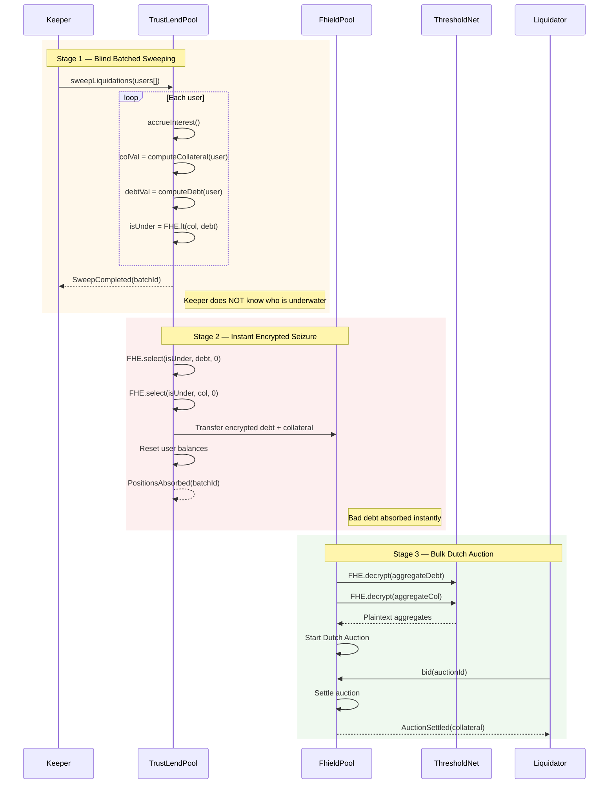
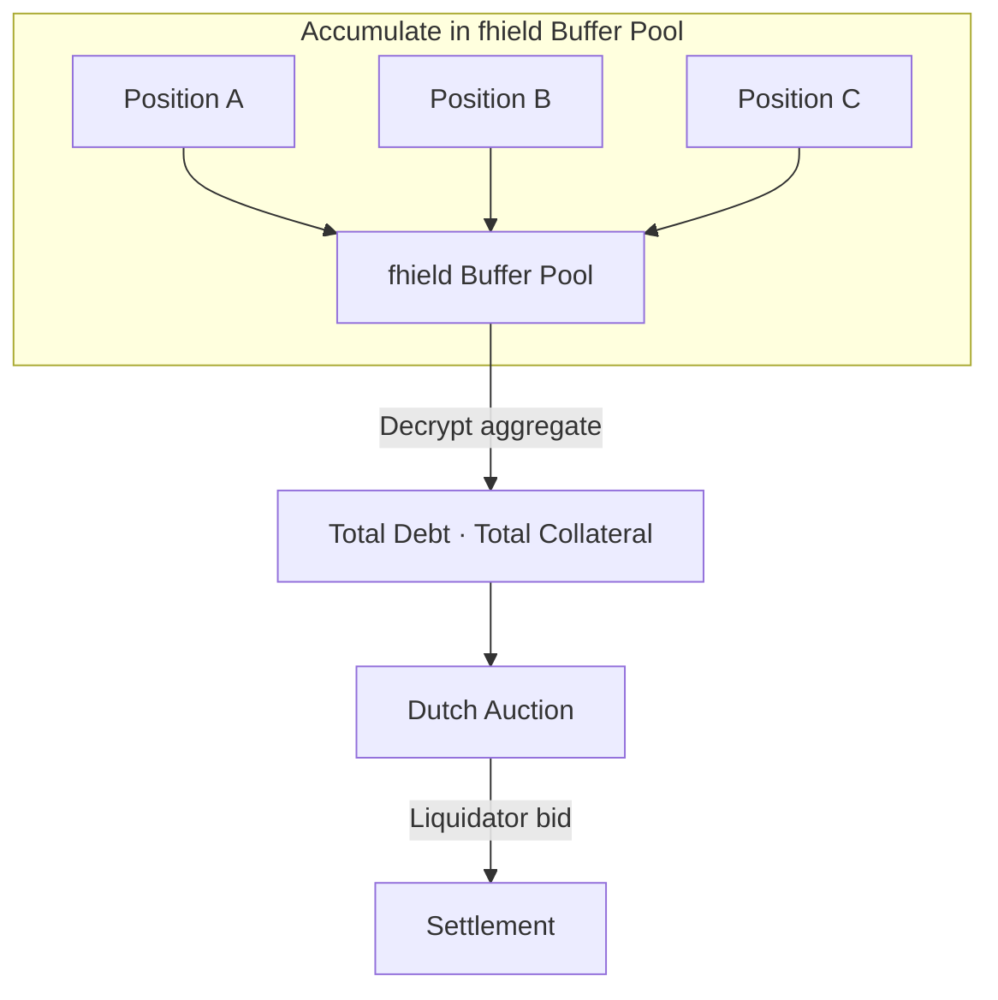

# Liquidation — fhield Buffer Model

:::tip What Makes This Different
fhield is the **first lending protocol** to solve the FHE liquidation trilemma: maintaining borrower privacy, ensuring instant bad debt absorption, and eliminating MEV — all in a single unified architecture. The fhield Buffer Model is fhield's flagship innovation.
:::

Liquidation in fhield is a **privacy-preserving risk management system** built on the **fhield Buffer Model** architecture. Instead of forcing liquidators to target individual users (which leaks identity), the protocol absorbs bad debt into an intermediary **fhield Buffer Pool** within encrypted space, then auctions it to liquidators in bulk via a **Dutch Auction**.

### Design Philosophy: Decoupled Liquidation

| Principle | Description |
|---|---|
| **Identity Privacy** | No one knows which user in a batch was liquidated |
| **Instant Bad Debt Absorption** | Protocol handles bad debt immediately in FHE space — no decryption wait |
| **Bulk Settlement** | Liquidators purchase from the fhield Buffer Pool, never interact with users directly |

---

## Why the fhield Buffer Model?

Naive adaptation of AAVE V3 liquidation to FHE creates three critical problems:

### 1. The Discovery Problem

In AAVE V3, liquidators scan on-chain to find users with Health Factor < 1. In FHE, all balances are encrypted — **liquidators have no way to discover who needs to be liquidated**.

The legacy 2-step approach (calling `liquidationCall()` on individual users) forces liquidators to guess blindly or spam calls — leaking information through pattern analysis.

### 2. Privacy Leakage on Decrypt

In Step 2 of the legacy model, `executeLiquidation()` requires an exact plaintext `debtToCover` and performs a plaintext ERC20 transfer. This **exposes the borrower's debt amount and seized collateral** on-chain.

### 3. Bad Debt Risk from Async Latency

Between Step 1 (decrypt request) and Step 2 (execution), there is an MPC decryption delay (~seconds to minutes). During this window, the price can continue dropping — making the position **fully underwater** before liquidation completes.

---

## The 3-Stage Flow



---

### Stage 1: Blind Batched Sweeping

Keepers/Bots call `sweepLiquidations(address[] users)` with an arbitrary list of users. The protocol checks each user's health factor entirely in **encrypted space**.

**Key properties:**
- Keepers submit batches **blindly** — no need to know who is actually underwater
- Health checks run entirely in FHE space: `isUndercollateralized = FHE.lt(collateralValue, debtValue)`
- The `ebool` result for each user is **never decrypted** for the Keeper
- Keepers can sweep the entire user list periodically (every block, every epoch)
- The `SweepCompleted` event only emits `batchId` and `userCount` — it does not reveal who was liquidated

```solidity
function sweepLiquidations(address[] calldata users) external nonReentrant returns (bytes32 batchId) {
    batchId = keccak256(abi.encodePacked(block.number, msg.sender, _sweepNonce++));

    for (uint256 i = 0; i < users.length; i++) {
        _accrueAllReserves();
        euint64 colVal = _computeEncryptedLiquidationCollateralValue(users[i]);
        euint64 debtVal = _computeEncryptedDebtValue(users[i]);
        ebool isUnder = FHE.lt(colVal, debtVal);
        FHE.allowThis(isUnder);

        _pendingSweep[batchId][users[i]] = SweepEntry({
            isUndercollateralized: isUnder,
            processed: false
        });
    }

    _sweepBatches[batchId] = SweepBatch({
        keeper: msg.sender,
        users: users,
        timestamp: block.timestamp
    });

    emit SweepCompleted(batchId, users.length);
}
```

### Stage 2: Instant Encrypted Seizure

:::info Core Innovation
This is the breakthrough of the fhield Buffer Model. Instead of waiting for decryption to act, the protocol **immediately transfers** debt and collateral into the fhield Buffer Pool **within FHE space** using `FHE.select()`.
:::

```solidity
// If isUnder = true  → transfer all debt/collateral to fhield Buffer Pool
// If isUnder = false → transfer 0 (no effect)
euint64 debtToTransfer = FHE.select(isUnder, userDebt, FHE.asEuint64(0));
euint64 colToTransfer = FHE.select(isUnder, userCollateral, FHE.asEuint64(0));

_fhieldDebtPool[asset] = FHE.add(_fhieldDebtPool[asset], debtToTransfer);
_fhieldColPool[asset] = FHE.add(_fhieldColPool[asset], colToTransfer);

_debtBalances[user][asset] = FHE.sub(userDebt, debtToTransfer);
_collateralBalances[user][asset] = FHE.sub(userCollateral, colToTransfer);
```

**Why no decryption is needed:**

`FHE.select()` operates on ciphertexts — it never needs to know the actual values. If the user is healthy, both `debtToTransfer` and `colToTransfer` are encrypted zeros. If the user is underwater, the entire position moves to the fhield Buffer Pool. **No information is ever leaked.**

**Benefits:**
- **Zero latency** between detection and resolution
- Price cannot drop further while waiting — **eliminates bad debt risk**
- User positions are reset immediately

### Stage 3: Bulk Dutch Auction

The fhield Buffer Pool accumulates multiple liquidated positions over time. When the pool reaches a threshold or on a scheduled basis, the protocol decrypts the **total aggregate** (not individual positions) and opens a Dutch Auction.



**Dutch Auction Mechanics:**

1. **Starting Price**: Aggregate collateral value × `(1 - INITIAL_DISCOUNT)` — typically starts at ~98% of real value
2. **Decay**: Price drops by `DUTCH_AUCTION_DECAY_RATE` each block until a buyer appears
3. **Settlement**: The first liquidator to call `bid()` receives all collateral in the auction, paying the corresponding debt tokens
4. **Surplus**: If collateral > debt (surplus exists), the remainder flows to the protocol treasury

```
currentPrice = startPrice × (1 - DUTCH_AUCTION_DECAY_RATE × elapsedBlocks)
```

**Dutch Auction Example:**

| Block | Elapsed | Price (% of collateral value) | Status |
|-------|---------|-------------------------------|--------|
| 0 | 0 | 98% | Awaiting bid |
| 10 | 10 | 97% | Awaiting bid |
| 50 | 50 | 93% | Awaiting bid |
| 73 | 73 | **90.7%** | ← Liquidator bids here |

The liquidator pays debt tokens (e.g., \$10,000 USDC) and receives collateral worth \$10,000 / 0.907 ≈ **\$11,025** → profit of ~\$1,025.

---

## Liquidator Incentives

### 1. Bulk Discount

Instead of liquidating individual users (many gas-expensive transactions), liquidators purchase in bulk from the fhield Buffer Pool. A single transaction can settle dozens of positions → **high gas efficiency**.

### 2. Dutch Auction Profit

Price starts near market value and decays over time. Liquidators "lock in" at a price point where they see profit. Waiting longer means cheaper prices, but risks being outbid → creating **natural game theory** that drives fast settlement.

### 3. MEV-Free by Design

In the legacy model, liquidators compete via gas wars and MEV to "snipe" liquidations. In the fhield Buffer Model, the Dutch Auction **eliminates MEV** because:
- Price decays uniformly — there is no "optimal moment" to frontrun
- Everyone sees the same price at the same block
- No hidden information to exploit (aggregate is already decrypted)

### ROI Comparison

| Factor | Legacy Model (per-user) | fhield Buffer Model (bulk) |
|---|---|---|
| Gas per liquidation | ~300k-500k gas | ~150k gas (amortized) |
| Must identify user? | Yes | No |
| Profit | Fixed bonus (5%) | Dutch Auction dynamic (3-15%) |
| MEV risk | High | Near zero |
| Capital efficiency | Low (many small txs) | High (one large tx) |

---

## Privacy Properties

### Comparison: Legacy Model vs. fhield Buffer Model

| Property | Legacy (2-step AAVE) | fhield Buffer Model |
|---|---|---|
| **Identity Privacy** | ❌ Liquidator specifies borrower address → linkable | ✅ Blind batch sweep — no one knows who was liquidated |
| **Balance Privacy** | ❌ `debtToCover` and seized amount exposed as plaintext in Step 2 | ✅ Only the **aggregate total** of the fhield Buffer Pool is decrypted |
| **MEV Resistance** | ❌ Liquidators frontrun each other, gas wars | ✅ Dutch Auction — uniform price decay, no optimal frontrun point |
| **Timing Leakage** | ⚠️ Two separate txs → observer knows when decrypt completed | ✅ Seizure is instant; auction is a separate process |
| **Amount Linkability** | ❌ Plaintext amount links directly to borrower | ✅ Aggregate obscures individual positions |

### Detailed Analysis

**Identity Privacy (Linkability)**

- *Legacy*: `liquidationCall(collateral, debt, borrower)` — the borrower's address is in the calldata. Anyone scanning the mempool knows user X is being liquidated.
- *fhield*: `sweepLiquidations([addr1, addr2, ..., addrN])` — a batch of N addresses. An observer only knows "N users were checked," not which (if any) were actually liquidated. Stage 2 executes entirely in encrypted space.

**Balance Privacy (Amount Leakage)**

- *Legacy*: `executeLiquidation(requestId, debtToCover=425)` — 425 is visible as plaintext, from which the total debt ≈ \$850 can be inferred (since CLOSE_FACTOR = 50%).
- *fhield*: No individual position is ever decrypted. The fhield Buffer Pool accumulates multiple positions then decrypts the **total**. E.g., aggregate = \$50,000 debt — no one can determine how many users contributed or how much each owed.

**MEV Resistance**

- *Legacy*: Liquidator A submits a tx, Liquidator B sees it in the mempool → frontruns with higher gas → MEV extraction.
- *fhield*: The Dutch Auction decreases price continuously. Liquidators choose timing based on personal risk/reward. No "hidden information advantage" exists → MEV is near zero.

---

## Technical Parameters

| Parameter | Value | Unit | Description |
|---|---|---|---|
| `CLOSE_FACTOR` | 5000 | BPS (50%) | Maximum portion of total debt that can be liquidated per sweep |
| `LIQUIDATION_THRESHOLD` | Per-asset (e.g., 8000) | BPS (80%) | Health factor trigger for liquidation |
| `LIQUIDATION_BONUS` | Per-asset (e.g., 500) | BPS (5%) | Collateral bonus for the protocol (feeds into fhield Buffer Pool) |
| `DUTCH_AUCTION_DECAY_RATE` | 10 | BPS/block (0.1%) | Price decay rate per block |
| `DUTCH_AUCTION_MIN_PRICE` | 8000 | BPS (80%) | Floor price — auction halts at this level |
| `SWEEP_COOLDOWN` | 10 | blocks | Minimum interval between sweeps for the same user |
| `FHIELD_AUCTION_TRIGGER` | Governance | — | Threshold to trigger auction (aggregate size or time-based) |

### Precision

All BPS parameters use `PERCENTAGE_PRECISION = 10000`. Interest rate indices use **RAY precision** (`1e27`) per the AAVE V3 standard. FHE balances use `euint64` with `NORMALIZATION_FACTOR = 1e6` for overflow safety.

### LTV vs. Liquidation Threshold

```
|-------- LTV (75%) --------|--- Buffer (5%) ---|
                             |-- Liq. Threshold (80%) --|
```

- **LTV** (e.g., 75%): Maximum borrowing power as a percentage of collateral value
- **Liquidation Threshold** (e.g., 80%): Position is flagged as underwater when collateral value / debt value falls below this
- **Safety Buffer** (5%): The gap between max borrow and liquidation — gives users time to top-up

---

## End-to-End Example

### Setup

- **Alice**: 1000 USDC collateral (price \$1, liq. threshold 80% → effective \$800), debt \$850
- **Bob**: 500 WETH collateral, \$300 DAI debt (healthy)
- **Charlie**: 2 ETH collateral (price \$400 → \$800, threshold 80% → \$640), debt \$650

### Stage 1: Keeper sweeps [Alice, Bob, Charlie]

```
Keeper → sweepLiquidations([Alice, Bob, Charlie])

Alice:   colVal=$800 (encrypted), debtVal=$850 (encrypted) → FHE.lt → true  (encrypted)
Bob:     colVal=$400 (encrypted), debtVal=$300 (encrypted) → FHE.lt → false (encrypted)
Charlie: colVal=$640 (encrypted), debtVal=$650 (encrypted) → FHE.lt → true  (encrypted)

→ Event: SweepCompleted(batchId=0x..., userCount=3)
```

The Keeper **does not know** Alice and Charlie are underwater. They only know "3 users were swept."

### Stage 2: Instant Seizure (CLOSE_FACTOR = 50%)

```
Protocol (internal, encrypted):
  Alice:   FHE.select(true, debt * 50% = $425, 0) → $425 debt to fhield Buffer Pool
           FHE.select(true, col * 50% = 500 USDC, 0) → 500 USDC to fhield Buffer Pool
           Alice retains: $425 debt, 500 USDC collateral (still underwater)
  Bob:     FHE.select(false, ...) → $0 → unaffected
  Charlie: FHE.select(true, debt * 50% = $325, 0) → $325 debt to fhield Buffer Pool
           FHE.select(true, col * 50% = 1 ETH, 0) → 1 ETH to fhield Buffer Pool
           Charlie retains: $325 debt, 1 ETH collateral

fhield Buffer Pool now holds (encrypted):
  Debt:       $750 (425 + 325)
  Collateral: 500 USDC + 1 ETH ($900 total)
```

### Stage 3: Dutch Auction

```
Protocol decrypts AGGREGATE:
  Total debt       = $750
  Total collateral = $900

Dutch Auction:
  Starting price = $900 × 0.98 = $882
  Block 0:   $882 (98.0%)
  Block 20:  $864 (96.0%)
  Block 40:  $846 (94.0%)  ← Liquidator bids here

Liquidator pays $750 in debt tokens
Liquidator receives collateral worth $846
Profit  = $846 - $750 = $96 (12.8% return)
Surplus = $900 - $846 = $54 → protocol treasury
```

---

## Relationship to Current Smart Contracts

The existing codebase already provides the primitives required for the fhield Buffer Model:

| Component | Status | Role in fhield Buffer Model |
|---|---|---|
| `TrustLendPool.sweepLiquidations()` | ✅ Implemented | Stage 1+2 — blind batched health check + instant encrypted seizure |
| `TrustLendPool.requestAuction()` | ✅ Implemented | Stage 3a — triggers decrypt of fhield pool aggregates |
| `TrustLendPool.startAuction()` | ✅ Implemented | Stage 3b — creates Dutch Auction with decrypted values |
| `TrustLendPool.bid()` | ✅ Implemented | Stage 3c — liquidator bids at current Dutch Auction price |
| `FHE.select()` (Zero-replacement) | ✅ Core pattern | Stage 2 — encrypted seizure without decryption |
| `IFhieldBuffer` | ✅ Interface defined | Relief hook — extensible for future insurance/treasury modules |
| `FhieldBufferStub` | ✅ Stub (0%) | Placeholder — returns 0% relief share |
| `_fhieldDebtPool` / `_fhieldColPool` | ✅ Implemented | Encrypted buffer pool state per asset |
| `CLOSE_FACTOR` (50%) | ✅ Configured | Each sweep seizes at most 50% of an underwater user's position |
| `DUTCH_AUCTION_DECAY_RATE` (10 BPS/block) | ✅ Configured | Price decay per block during auction |
| `DUTCH_AUCTION_MIN_PRICE` (80%) | ✅ Configured | Floor price — prevents auction from going below 80% |
| `liquidationThreshold` | ✅ Per-asset | Trigger for the encrypted `FHE.lt` health check |
| Constant-time loops | ✅ Pattern used | Protects Stage 1 from timing analysis |

### Architecture Status

```
✅ Phase 1 (legacy):   liquidationCall() + executeLiquidation() → REMOVED
✅ Phase 2 (current):  sweepLiquidations() + fhield Buffer Pool + Dutch Auction → IMPLEMENTED
🔄 Phase 3 (future):   Automated Keeper network + DAO-governed auction params
```
