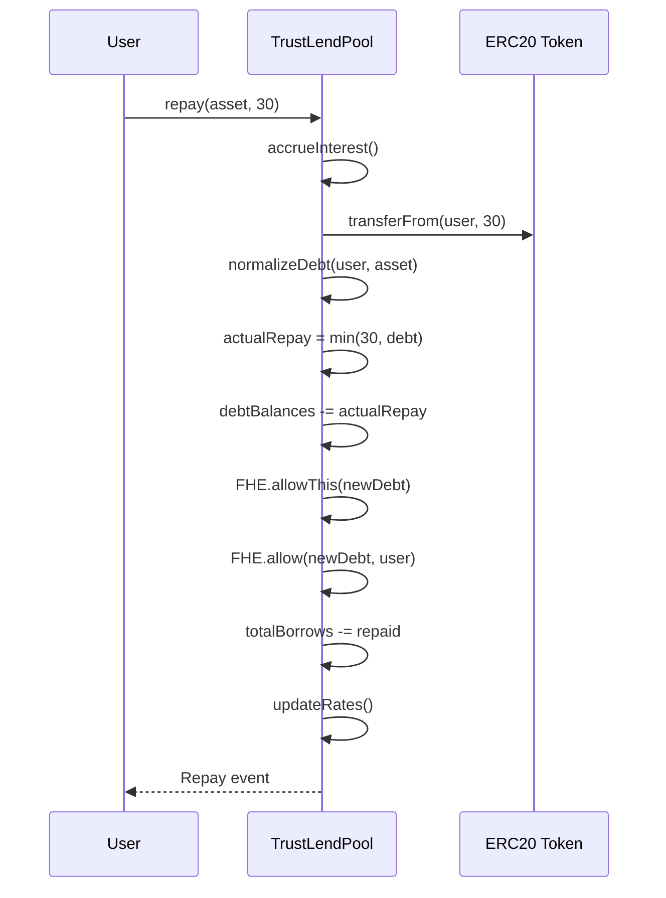

# Repay Flow

Repaying reduces the user's encrypted debt. This is a **single-step** operation because it takes plaintext input.

## Sequence

## Steps

1. **Interest Accrual**: Updates reserve indices
2. **Token Transfer**: Moves repayment tokens from user to pool
3. **Normalize Debt**: Applies accrued interest to the user's encrypted debt via index growth
4. **Cap Payment**: Uses `FHELendingMath.encryptedMin(repayAmount, normalizedDebt)` — you can't repay more than you owe
5. **Update Debt**: Subtracts actual repayment from encrypted debt balance
6. **ACL Update**: Re-grants `FHE.allowThis()` and `FHE.allow(user)` for the new debt handle
7. **Rate Update**: Recalculates rates with new utilization

## Notes

- Repay is synchronous — no async decrypt needed since the input is plaintext
- If `amount > debt`, only the debt amount is actually applied (overpayment protection via encrypted min)
- The plaintext `totalBorrows` is updated using `min(amount, estimatedBorrows)` — an approximation since exact encrypted debt isn't available in plain
