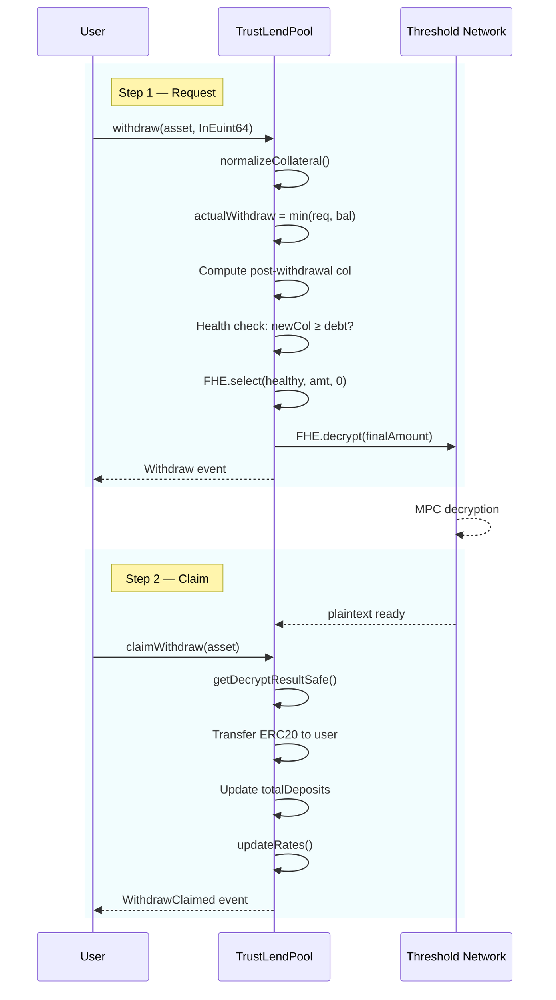

# Withdraw Flow

Withdrawing removes collateral from the pool. Like borrowing, this is a **two-step async** operation because the withdrawal amount must be decrypted before ERC20 tokens can be transferred.

## Sequence

## Step 1: `withdraw(asset, InEuint64)`

1. **Normalize**: Apply accrued interest to collateral balance
2. **Cap**: `min(requestedAmount, normalizedBalance)` — can't withdraw more than deposited
3. **Health Projection**: Compute what collateral value would be AFTER withdrawal
4. **Health Check**: `newCollateral >= totalDebt`
5. **Zero-Replacement**: If withdrawal would make position unhealthy, amount becomes 0
6. **Decrypt**: Submit to Threshold Network

## Step 2: `claimWithdraw(asset)`

1. **Check Ready**: Decrypt must be complete
2. **Transfer**: Send decrypted amount in ERC20 to user
3. **Update**: Adjust `totalDeposits`, recalculate rates

## Health Check Details

The withdrawal health check considers ALL assets, not just the one being withdrawn. For the withdrawn asset, it uses `(balance - withdrawAmount)` instead of `balance` when computing total collateral value. This ensures users can't withdraw themselves into a liquidatable position.
